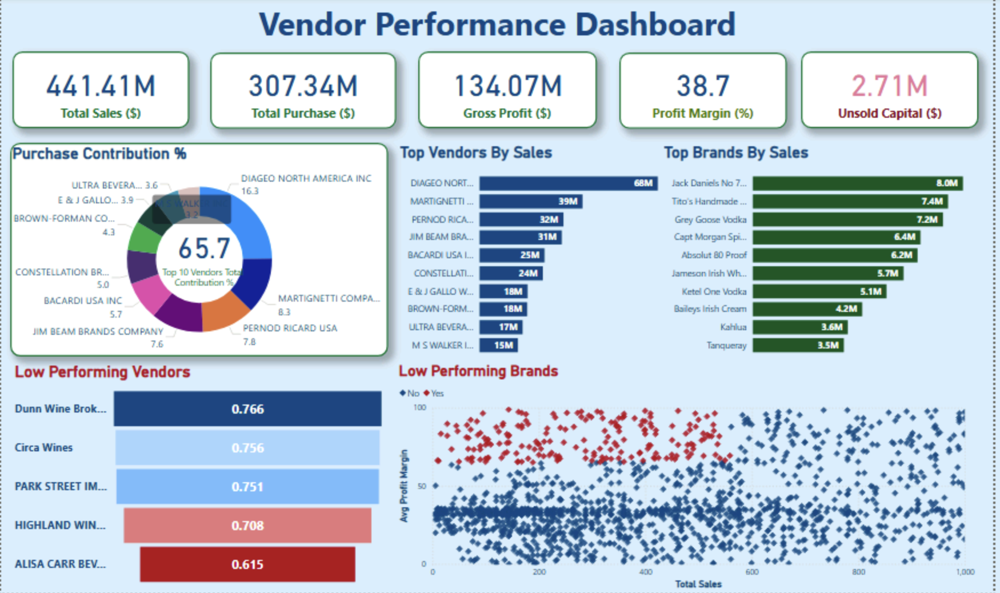

<!DOCTYPE html>
<html lang="en">
<head>
    <meta charset="UTF-8">
</head>
<body>

<h1>🧾 Vendor Performance Analysis – Retail Inventory & Sales</h1>

Analyzing vendor efficiency and profitability to support strategic purchasing and inventory decisions using SQL, Python, and Power BI.

<h2>📌 Table of Contents</h2>
<ul>
    <li><a href="#overview">Overview</a></li>
    <li><a href="#business-problem">Business Problem</a></li>
    <li><a href="#dataset">Dataset</a></li>
    <li><a href="#tools-technologies">Tools & Technologies</a></li>
    <li><a href="#project-structure">Project Structure</a></li>
    <li><a href="#data-cleaning">Data Cleaning & Preparation</a></li>
    <li><a href="#eda">Exploratory Data Analysis (EDA)</a></li>
    <li><a href="#research-findings">Research Questions & Key Findings</a></li>
    <li><a href="#dashboard">Dashboard</a></li>
    <li><a href="#how-to-run">How to Run This Project</a></li>
    <li><a href="#final-recommendations">Final Recommendations</a></li>
    <li><a href="#author-contact">Author & Contact</a></li>
</ul>

<h2 id="overview">Overview</h2>

This project evaluates vendor performance and retail inventory dynamics to drive strategic insights for purchasing, pricing, and inventory optimization. A complete data pipeline was built using SQL for ETL, Python for analysis and hypothesis testing, and Power BI for visualization.

<h2 id="business-problem">Business Problem</h2>

Effective inventory and sales management are critical in the retail sector. This project aims to:

<ul>
    <li>Identify underperforming brands needing pricing or promotional adjustments</li>
    <li>Determine vendor contributions to sales and profits</li>
    <li>Analyze the cost-benefit of bulk purchasing</li>
    <li>Investigate inventory turnover inefficiencies</li>
    <li>Statistically validate differences in vendor profitability</li>
</ul>

<h2 id="dataset">Dataset</h2>
<ul>
    <li>Multiple CSV files located in <code>/data/</code> folder (sales, vendors, inventory)</li>
    <li>Summary table created from ingested data and used for analysis</li>
</ul>

<h2 id="tools-technologies">Tools & Technologies</h2>
<ul>
    <li>SQL (Common Table Expressions, Joins, Filtering)</li>
    <li>Python (Pandas, Matplotlib, Seaborn, SciPy)</li>
    <li>Power BI (Interactive Visualizations)</li>
    <li>GitHub</li>
</ul>

<h2 id="project-structure">Project Structure</h2>
<pre><code>
vendor-performance-analysis/
├── README.md
├── .gitignore
├── requirements.txt
├── Vendor Performance Report.pdf
├── notebooks/
│   ├── exploratory_data_analysis.ipynb
│   └── vendor_performance_analysis.ipynb
├── scripts/
│   ├── ingestion_db.py
│   └── get_vendor_summary.py
├── dashboard/
│   └── vendor_performance_dashboard.pbix
</code></pre>

<h2 id="data-cleaning">Data Cleaning & Preparation</h2>
<ul>
    <li>Removed transactions with:
        <ul>
            <li>Gross Profit ≤ 0</li>
            <li>Profit Margin ≤ 0</li>
            <li>Sales Quantity = 0</li>
        </ul>
    </li>
    <li>Created summary tables with vendor-level metrics</li>
    <li>Converted data types, handled outliers, merged lookup tables</li>
</ul>

<h2 id="eda">Exploratory Data Analysis (EDA)</h2>
<h3>Negative or Zero Values Detected</h3>
<ul>
    <li>Gross Profit: Min -52,002.78 (loss-making sales)</li>
    <li>Profit Margin: Min -∞ (sales at zero or below cost)</li>
    <li>Unsold Inventory: Indicating slow-moving stock</li>
</ul>
<h3>Outliers Identified</h3>
<ul>
    <li>High Freight Costs (up to 257K)</li>
    <li>Large Purchase/Actual Prices</li>
</ul>
<h3>Correlation Analysis</h3>
<ul>
    <li>Weak between Purchase Price & Profit</li>
    <li>Strong between Purchase Qty & Sales Qty (0.999)</li>
    <li>Negative between Profit Margin & Sales Price (-0.179)</li>
</ul>

<h2 id="research-findings">Research Questions & Key Findings</h2>
<ul>
    <li>Brands for Promotions: 198 brands with low sales but high profit margins</li>
    <li>Top Vendors: Top 10 vendors = 65.69% of purchases → risk of over-reliance</li>
    <li>Bulk Purchasing Impact: 72% cost savings per unit in large orders</li>
    <li>Inventory Turnover: $2.71M worth of unsold inventory</li>
    <li>Vendor Profitability:
        <ul>
            <li>High Vendors: Mean Margin = 31.17%</li>
            <li>Low Vendors: Mean Margin = 41.55%</li>
        </ul>
    </li>
    <li>Hypothesis Testing: Statistically significant difference in profit margins → distinct vendor strategies</li>
</ul>

## Dashboard  

Power BI Dashboard shows:  

- Vendor-wise Sales and Margins  
- Inventory Turnover  
- Bulk Purchase Savings  
- Performance Heatmaps  

   

</ul>

<h2 id="how-to-run">How to Run This Project</h2>
<ol>
    <li>Clone the repository:
        <pre><code>git clone https://github.com/yourusername/vendor-performance-analysis.git</code></pre>
    </li>
    <li>Load the CSVs and ingest into database:
        <pre><code>python scripts/ingestion_db.py</code></pre>
    </li>
    <li>Create vendor summary table:
        <pre><code>python scripts/get_vendor_summary.py</code></pre>
    </li>
    <li>Open and run notebooks:
        <pre><code>notebooks/exploratory_data_analysis.ipynb
notebooks/vendor_performance_analysis.ipynb</code></pre>
    </li>
    <li>Open Power BI Dashboard:
        <pre><code>dashboard/vendor_performance_dashboard.pbix</code></pre>
    </li>
</ol>

<h2 id="final-recommendations">Final Recommendations</h2>
<ul>
    <li>Diversify vendor base to reduce risk</li>
    <li>Optimize bulk order strategies</li>
    <li>Reprice slow-moving, high-margin brands</li>
    <li>Clear unsold inventory strategically</li>
    <li>Improve marketing for underperforming vendors</li>
</ul>

<h2 id="author-contact">Author & Contact</h2>

Bhuwan Regmi 
Data Analyst

<ul>
    <li>📧 Email: <a href="regmibhuwan555@Gmail.com">regmibhuwan555@Gmail.com</a></li>
    <li>🔗 <a href="https://www.linkedin.com/in/regmibhuwan/">LinkedIn</a></li>
</ul>

</body>
</html>
